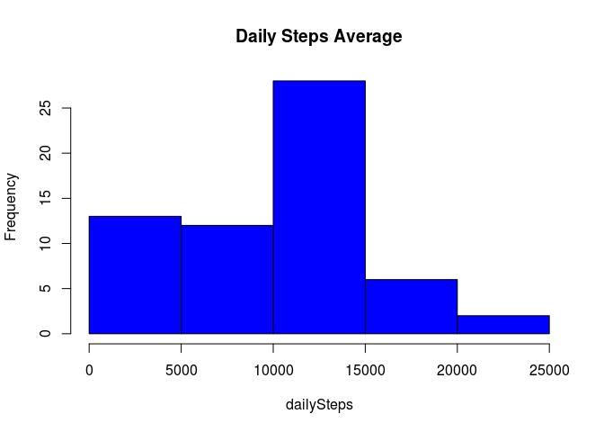
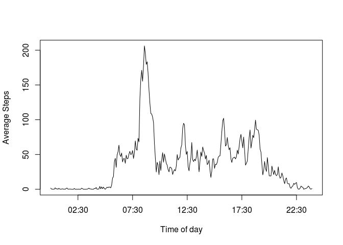

# Reproducible Research: Peer Assessment 1
Victor Zambrano  


## Loading and preprocessing the data

```r
completeSteps <- read.csv('data/activity.csv')
minuteAverage <- tapply(completeSteps$steps, completeSteps$interval, mean, na.rm = TRUE)
DFminuteAverage <- as.data.frame(minuteAverage)
```


## What is mean total number of steps taken per day?

In order to calculate the mean over different days, we use de tapply function.


```r
dailySteps <- tapply(completeSteps$steps, completeSteps$date, sum, na.rm = TRUE)
dailyStepsMean <- mean(dailySteps)
dailyStepsMedian <- median(dailySteps)
```

Each day the subject takes 9354.2295082 steps per day on average, with a
median of 10395. Over the 61 days that the
test was taken, the average steps taken per day is described in the following histogram


```r
hist(dailySteps, main = 'Daily Steps Average', col = 'blue')
```

 


## What is the average daily activity pattern?

In this section we attemp to plot daily activity, and the way to do that is to plot the
average steps taken in every five-minute-frame. The *X* axis for this plot
would be the time of the day and the *Y* axis would be the average steps taken in that
time frame.

### X-Axis time of day

The available data comes in the form of character vectors, which range from one-digit
numbers (again... in string format), to four-digit numbers. E.g. '635' would be 06:35 a.m.

To get the format we desire, we need a helper function


```r
dateFormat <- function(cadena){
  as.POSIXct(substr(paste('000', cadena, sep = ''),
                    nchar(cadena), nchar(cadena)+3), format = '%H%M')
}
```

And now the vector for the *X* axis is obtained simply by:


```r
minutes <- dateFormat(rownames(DFminuteAverage))
```

### Y-axis average number of steps

This is much simpler... This result was previously computed

`minuteAverage <- tapply(completeSteps$steps, completeSteps$interval, mean, na.rm = TRUE)`

### Making the plot


```r
library(graphics)
library(grDevices)
plot(minutes, DFminuteAverage$minuteAverage, type = 'l', xlab = 'Time of day',
     ylab = 'Average Steps')
```

 

### Maximum Performance time interval

The maximum performance time interval is computed by:


```r
max_performance <- minutes[which(minuteAverage == max(minuteAverage))]
idealMinute <- substr(max_performance, 12, 16)
```

Which results in 08:35

## Imputing missing values

In this section will do the following:

### Calculate and report the total number of missing values in the dataset 


```r
num_NA <- sum(is.na(completeSteps$steps))
```

The total of NA values is 2304

### Devise a strategy for filling in all of the missing values in the dataset

The chosen strategy will be to substitute NA values with the mean for that 5-minute interval


```r
# 
# completeSteps$processed <- 0
# for (iter in 1:length(stepsDay2$steps)){
#   if (is.na(completeSteps$steps[iter])){
#     completeSteps$processed[iter] <- minuteAverage[[((iter-1) %% length(minuteAverage))+1]]
#   } else {
#     stepsDay2$processed[iter] <- completeSteps$steps[iter]
#   }
# }
```

### Make a histogram of the total number of steps taken each day
Calculate and report the mean and median total number of steps taken per day. Do these values differ from the estimates from the first part of the assignment? What is the impact of imputing missing data on the estimates of the total daily number of steps?


Now we process the data to substitute NA values with the average steps taken on a
5-minute time frame


## Are there differences in activity patterns between weekdays and weekends?
