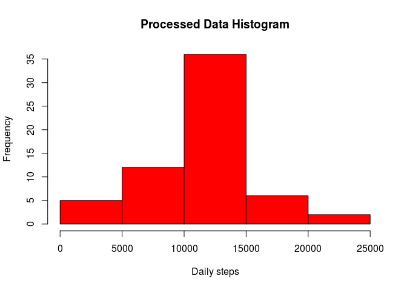
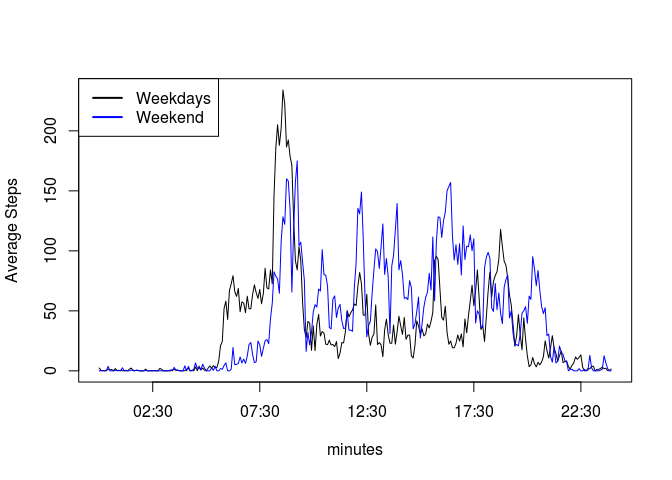

# Reproducible Research: Peer Assessment 1
Victor Zambrano  


## Loading and preprocessing the data

```r
completeSteps <- read.csv('data/activity.csv')
minuteAverage <- tapply(completeSteps$steps, completeSteps$interval, mean, na.rm = TRUE)
DFminuteAverage <- as.data.frame(minuteAverage)
```


## What is mean total number of steps taken per day?

In order to calculate the mean over different days, we use de tapply function.


```r
dailySteps <- tapply(completeSteps$steps, completeSteps$date, sum, na.rm = TRUE)
dailyStepsMean <- mean(dailySteps)
dailyStepsMedian <- median(dailySteps)
```

Each day the subject takes 9354.2295082 steps per day on average, with a
median of 10395. Over the 61 days that the
test was taken, the average steps taken per day is described in the following histogram


```r
hist(dailySteps, main = 'Daily Steps Average', col = 'blue')
```

 


## What is the average daily activity pattern?

In this section we attemp to plot daily activity, and the way to do that is to plot the
average steps taken in every five-minute-frame. The *X* axis for this plot
would be the time of the day and the *Y* axis would be the average steps taken in that
time frame.

### X-Axis time of day

The available data comes in the form of character vectors, which range from one-digit
numbers (again... in string format), to four-digit numbers. E.g. '635' would be 06:35 a.m.

To get the format we desire, we need a helper function


```r
dateFormat <- function(cadena){
  as.POSIXct(substr(paste('000', cadena, sep = ''),
                    nchar(cadena), nchar(cadena)+3), format = '%H%M')
}
```

And now the vector for the *X* axis is obtained simply by:


```r
minutes <- dateFormat(rownames(DFminuteAverage))
```

### Y-axis average number of steps

This is much simpler... This result was previously computed

`minuteAverage <- tapply(completeSteps$steps, completeSteps$interval, mean, na.rm = TRUE)`

### Making the plot


```r
library(graphics)
library(grDevices)
plot(minutes, DFminuteAverage$minuteAverage, type = 'l', xlab = 'Time of day',
     ylab = 'Average Steps')
```

 

### Maximum Performance time interval

The maximum performance time interval is computed by:


```r
max_performance <- minutes[which(minuteAverage == max(minuteAverage))]
idealMinute <- substr(max_performance, 12, 16)
```

Which results in 08:35

## Imputing missing values

In this section will do the following:

### Calculate and report the total number of missing values in the dataset 


```r
num_NA <- sum(is.na(completeSteps$steps))
```

The total of NA values is 2304

### Devise a strategy for filling in all of the missing values in the dataset

The chosen strategy will be to substitute NA values with the mean for that 5-minute interval


```r
completeSteps$processed <- 0
for (iter in 1:length(completeSteps$steps)){
  if (is.na(completeSteps$steps[iter])){
    completeSteps$processed[iter] <- minuteAverage[((iter-1) %% length(minuteAverage))+1]
  } else {
    completeSteps$processed[iter] <- completeSteps$steps[iter]
  }
}
```

Now we have an additional column for the substituted data

### Make a histogram of the total number of steps taken each day

In this section will use the new column to plot a histogram of the subtituted data


```r
newDailySteps <- tapply(completeSteps$processed, completeSteps$date, sum)
newDailyStepsMean <- mean(newDailySteps)
newDailyStepsMedian <- median(newDailySteps)
hist(newDailySteps, main = 'Processed Data Histogram', xlab = 'Daily steps',col = 'red')
```

 

The daily steps mean for the modfied data is 1.0766189\times 10^{4} which is higher than the previous 9354.2295082.

The daily steps median for the modified data is 1.0766189\times 10^{4} which is also 
higher than the previous 10395

## Are there differences in activity patterns between weekdays and weekends?

Yes, there are. That will be shown in a standard XY with two series: one for weekdays
and one for weekends.

First, we'll create the necessary data in the form of a data frame with two columns:
'Weekday' and 'Weekend' which will contain the average steps taken in a 5-minute time-frame.

Depending on the locale the `weekend_days` variable
should be adjusted:


```r
weekend_days <- c('sábado', 'domingo') # es_VE.utf8 locale
weekClass <- ifelse(weekdays(as.POSIXct(completeSteps$date,
                                        format = '%Y-%m-%d')) %in% weekend_days,
                    'Weekend', 'Weekday')
classifiedSteps <- lapply(split(completeSteps, weekClass),
                          function(x) tapply(x$steps, x$interval, mean, na.rm = TRUE))
```

Now we add the recently created data to the previously created `DFminuteAverage`


```r
DFminuteAverage$Weekday <- classifiedSteps$Weekday
DFminuteAverage$Weekend <- classifiedSteps$Weekend
```

And finally we plot the data


```r
plot(minutes, DFminuteAverage$Weekday, type = 'l', ylab = 'Average Steps')
lines(minutes, DFminuteAverage$Weekend, col = 'blue')
legendVector <- c('Weekdays', 'Weekend')
legend('topleft', legend = legendVector, col = c('black', 'blue'), lwd = 2)
```

 

